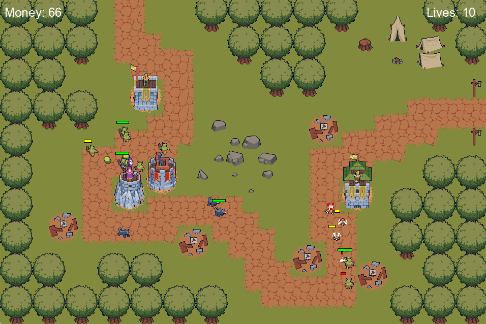

# Tower Defense Game

## Description
This game is a tower defense inspired by the *Kingdom Rush* series. Each level has a path where successive waves of enemies advance. If enemies reach the end of the path, the player loses health points. To stop them, the player must use money to build towers in the designated construction zones and upgrade them. Enemies drop money when defeated, and the player wins the level after defeating all enemies in all waves. The player can then proceed to the next level until completing the last one.

## Controls
The entire game is controlled with the mouse, using a point-and-click style.

- Clicking on an empty construction zone will display three icons representing the three available tower types.
- Clicking on an already constructed tower will show icons to upgrade or sell the tower. The "X" icon closes the menu.
- If an icon has a red background, the player does not have enough money to perform the action. If the upgrade icon is black, the tower cannot be upgraded further.
- At the start of a level, a button will appear in the top-left corner. Pressing it will begin the enemy waves.
- After winning or losing a level, buttons will appear to retry the level or proceed to the next one. The latter will not work if the last level has been completed.

### Tower Descriptions
The game does not include a menu with tower details, so here is a breakdown of each tower:

- **Archer Tower**  
  **Costs:** 70 → 110 → 160  
  Low damage, high attack speed.  
  Attacks both ground and flying enemies.

- **Mage Tower**  
  **Costs:** 100 → 160 → 240  
  High damage, medium attack speed.  
  Attacks both ground and flying enemies.

- **Catapult Tower**  
  **Costs:** 125 → 220 → 320  
  Medium area damage, slow attack speed.  
  Attacks only ground enemies.

---

## Technical Challenges

### Data-Driven Map
To create the level maps, I used Tiled and loaded them into the game using `tmxlite`. Since I could only load layers based on a tileset (and not individual images), I had to create a tileset containing all the varied-sized images I had. In Tiled, I also defined the enemy paths and construction zones using object layers with points. I processed these to store the paths in a `std::vector<Vector2f>` and to generate the interactive construction zones on the screen.

### Data-Driven Levels and Dynamic Level Loading
Each level is represented in the code by a `struct` containing:
- Initial health points
- Initial money
- Path to the `.tmx` map file
- Path to the `.json` file with wave information.

The `.json` data is parsed and stored in another `struct`, and enemies spawn dynamically during the level based on this data. Although the two existing levels use the same map, different maps could easily be assigned.

At any given time, only one level is loaded. To proceed to the next level or retry the current one, several managers reset their state by deleting all existing enemies and towers, restoring the interface to its initial state, and resetting various variables. Then, the `loadLevel` method in the `World` class initializes the new level. This process, however, is inefficient: calling the `init` method repeatedly to reset managers, which themselves call other `init` methods, leads to unnecessary overhead. Ideally, each class would have a separate `reload` method for resetting, while `init` would be called only once per instance. Refactoring this would require significant changes to the current codebase.

### Factory Pattern for Enemies and Towers
When implementing the system for creating enemies and towers, my initial approach involved polymorphism by creating base classes (`Enemy` and `Tower`) and deriving specific types from them. However, due to the tedious nature of C++ and the small amount of unique code per enemy/tower type, I realized that a factory pattern (or a similar approach) would be more efficient. 

I created factory classes responsible for instantiating enemies and towers. Managers call these factories with the type of enemy or tower they need, and the factory returns a pointer to the appropriate instance with the correct attributes. This approach centralized the large amount of code defining enemies and towers into their respective factories (e.g., `TowerFactory.cpp` has over 300 lines). Refactoring to this system took an entire day, and at one point, I encountered over 260 errors.

### Sound Manager Implementation
Adding sound to the game was challenging, especially understanding how `sf::SoundBuffer` and `sf::Sound` work in SFML. I needed a way for multiple classes to play sounds without scattering sound logic throughout the codebase. I created a `SoundManager` singleton class that stores a buffer for each sound in the game and provides public methods for other classes to play sounds without managing the sound data themselves.
